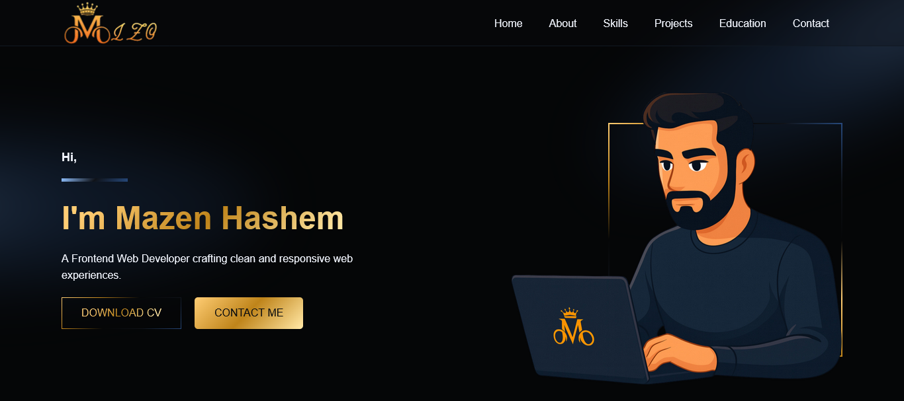

# Mazen Hashem – Portfolio Website



A responsive personal portfolio website built with **Next.js** and **React**.  
It showcases my selected projects, skills, education, and includes a contact form to reach me directly.

---

## 📌 Project Context

This portfolio was built to present my work as a **Frontend Web Developer**, highlight real projects, and provide a clean way for recruiters and clients to connect with me.

---

## 🚀 Features

- **Hero Section**: Clear intro with CTA buttons (**Download CV**, **Contact Me**)
- **About Section**: Professional summary + social links (LinkedIn, GitHub, WhatsApp)
- **Skills Section**: Skills grid generated from a data file
- **Projects Section**: Projects carousel with custom horizontal scrolling controls
- **Education Section**: Education cards styled as a timeline-like list
- **Contact Section**:
  - Phone link (`tel:`)
  - Email link (`mailto:`)
  - WhatsApp direct chat link
  - Contact form with validation + Formspree submission
- **Responsive Layout**: Works smoothly on desktop, tablet, and mobile
- **SEO & Social Sharing Ready**:
  - Meta title + description
  - Open Graph preview
  - Twitter card preview
- **Accessibility Friendly**: Discernible names for icon-only links and interactive elements

---

## 🛠️ Technologies Used

- **Next.js** for app structure and routing
- **React** for UI components
- **Custom CSS** (CSS Variables + responsive breakpoints)
- **Formspree** for contact form submission

---

## 📂 Project Structure

```text
src/
└── app/
    ├── globals.css            # Global styles + CSS variables
    ├── layout.jsx             # Root layout + metadata (SEO)
    ├── page.jsx               # Renders: <Header /> <Main /> <Footer />
    └── app.css                # App wrapper styles

components/
├── header/
│   ├── Header.jsx             # Fixed header + responsive nav menu
│   └── header.css
├── main/
│   ├── Main.jsx               # Contains all page sections
│   ├── main.css
│   ├── hero/
│   │   ├── Hero.jsx
│   │   └── hero.css
│   ├── aboutMe/
│   │   ├── AboutMe.jsx
│   │   └── aboutMe.css
│   ├── skills/
│   │   ├── Skills.jsx
│   │   ├── skills.css
│   │   ├── skillsData.jsx     # Skills list data
│   │   └── skill/
│   │       ├── Skill.jsx
│   │       └── skill.css
│   ├── projects/
│   │   ├── Projects.jsx
│   │   ├── projects.css
│   │   ├── projectsData.jsx   # Projects list data
│   │   └── project/
│   │       ├── Project.jsx
│   │       └── project.css
│   ├── education/
│   │   ├── Education.jsx
│   │   ├── education.css
│   │   ├── educationData.jsx  # Education list data
│   │   └── educate/
│   │       ├── Educate.jsx
│   │       ├── educate.css
│   │       └── descriptionItem/
│   │           ├── DescriptionItem.jsx
│   │           └── descriptionItem.css
│   └── contactMe/
│       ├── ContactMe.jsx
│       ├── contactMe.css
│       └── contactMeForm/
│           ├── ContactMeForm.jsx
│           └── contactMeForm.css
└── footer/
    ├── Footer.jsx             # Footer content
    └── footer.css

public/
├── images/                    # Hero, about, skills, projects images
├── icons/                     # favicon + social icons (svg)
└── cv/                        # CV PDF file
```

---

## ⚙️ Setup & Installation

1. Clone the repository:
```bash
git clone https://github.com/Mazen-Hashem/ApexcifyTechnologys_Portfolio.git
cd ApexcifyTechnologys_Portfolio
```
2. Install dependencies:
```bash
npm install
```
3. Start the development server:
```bash
npm run dev
```
4. Open the app in your browser at `http://localhost:3000`

---

## 🧩 Components Overview

### **Root Layout (layout.jsx)**
- Defines global metadata (title, description, Open Graph, Twitter card)
- Loads `globals.css`

### **Header**
- Fixed navigation with responsive mobile menu
- Smooth scroll links to all sections

### **Main**
Holds all sections:
- Hero
- About Me
- Skills
- Projects
- Education
- Contact Me

### **Projects**
- Custom horizontal slider using state + translateX
- Prev/Next buttons disable automatically at limits

### **ContactMeForm**
- Controlled inputs + validation for name, email, and message
- Submits via Formspree using `fetch()`
- Displays loading / success / error messages

### **Footer**
- Static footer with copyright

---

## 🎨 Styling & Layout

- **Theme**: Dark UI with gold/blue accents
- **Approach**: CSS Variables for consistent design system
- **Responsive**: Breakpoints for md/sm/xs layouts
- **UI Details**: Gradients, hover transitions, and consistent spacing

---

## 📌 Usage

1. Browse sections using the navbar or scroll
2. Download CV from the Hero section
3. Explore featured projects in the Projects carousel
4. Reach out via phone/email/WhatsApp, or send a message using the contact form

---

## 🧪 Future Improvements

- Replace `` with Next.js `<Image />` for stronger image optimization
- Add a “Featured Project” details page per project
- Add dark/light theme toggle
- Add internationalization (EN/AR)

---

## 🔗 Links

- **LinkedIn**: https://www.linkedin.com/in/mazenhashem/
- **GitHub**: https://github.com/Mazen-Hashem
- **Email**: Mazen.Hashem.Mohamed@gmail.com

---

## 📜 License
MIT License. All rights reserved.
